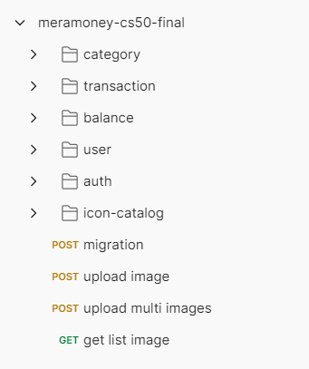
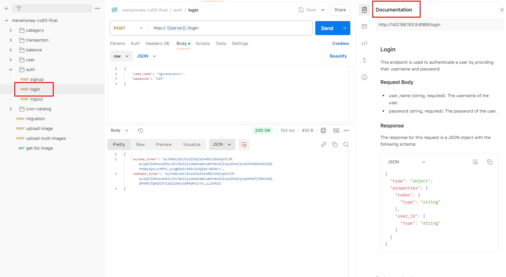

[Meramoney](https://cs50-final-meramoney.vercel.app)

# Project Meramoney


#### Video Demo: https://youtu.be/lj4KUtW5Z6g
#### Description:

MeraMoney is a personal finance management web application that helps users track their income and expenses.
Users can create categories for their transactions and view their transaction history.
The application also provides a dashboard that shows the user's total income, total expenses, and net income.
Users can also view their transaction history by category and date range.

MeraMoney is built using Go for the backend and React for the frontend.

This README.md use to provide information about the project, how to run the project, and how to use the project. And use for both frontend and backend services.
But you might want to read the README.md file at frontend directory because some image might miss in this README.md file in the backend directory.
#### Table of Contents:
- [Features](#features)
- [Technologies](#technologies)
- [Frontend](#frontend)
- [Backend](#backend)

#### Features:
- User authentication
- JWT-based authorization
- CRUD operations for categories
- CRUD operations for transactions
- Dashboard showing total income, total expenses, and net income
- Transaction history by category and date range

#### Technologies:
- Go
- PostgreSQL
- Docker
- Postman
- Git
- JWT
- RESTful API
- HTML
- CSS
- JavaScript
- Framework: React


MeraMoney source code is divided into two services:
- `meramoney-frontend`: storing the frontend source code
- `meramoney-backend`: storing the backend source code

## Frontend

`meramoney` frontend service is a React web application that allows users to manage their income and expenses.
It includes features such as user authentication, JWT-based authorization, and CRUD operations for categories and transactions.

#### Source Code:
- [Github]( https://github.com/ngxvu/cs50-final-meramoney) - branch: main

#### Getting Started:
Requirements:
- Node.js version: >=21.2.0

To run the frontend source code, you can follow these steps:
1. Clone the repository
2. Install the dependencies by running `npm install`
3. Start the application by running `npm start`
4. Open your browser and navigate to `http://localhost:3000`

## Backend

`meramoney` backend service for managing user profiles, categories, and transactions.
It includes features such as user authentication, JWT-based authorization, and CRUD operations for categories and transactions.
The project is built using Go and uses a PostgreSQL database.

#### Import Apis Postman Environment
https://api.postman.com/collections/36706608-37d0f96e-0d6c-4e6b-8e39-f25b44a7dbd6?access_key=PMAT-01JE8PAFZ97F7PZ95QN1JDYMCY

#### Source Code:
- [Github]( https://github.com/ngxvu/cs50-final-meramoney) - branch: backend

#### Getting Started
- Before you can run the project locally, please make sure you have at least one of the following installed on your machine:

  - Go 1.21 or higher
  - Docker and Docker Compose
  - PostgreSQL
  - Postman
  - Git


- You can create a .env file in the root directory of the project and add the following environment variables for my example records on my server.
```bash
PORT=8989

DB_HOST=143.198.193.9
DB_PORT=5435
DB_USERNAME=postgres
DB_PASSWORD=postgres
DB_DATABASE=meramoney

JWT_SECRET=meramoney

BASE_URL=http://143.198.193.9:8989
```

or you can use the following environment variables for your local machine.
```bash
PORT=8080

DB_HOST=localhost
DB_PORT=5432
DB_USERNAME=postgres
DB_PASSWORD=postgres
DB_DATABASE
```

- Or you can use the following docker-compose file to run the project locally.
  just run the following command to start the project, but make sure you have docker and docker compose installed on your machine.
```bash
docker-compose up
```
- When you run the docker-compose file, it will start the backend service and the database service in local docker containers.

- If you want to run the backend service without using docker, you need to have a PostgreSQL database running on your machine.

- You need to create a database and tables for the project.

- I do have a sql file that you can use to create the database and tables,
  you can find it in the root directory of the project :`internal/database/meramoney-table.sql`

- To create the database and tables, you can run the following command:
```bash
psql -U postgres -d meramoney -a -f internal/database/meramoney-table.sql
```

- Or just simple run the api to create the tables after you have the database created and having source code in your local machine.
```bash
curl --location --request POST 'http://localhost:8989/migrate'
```

- To start the backend source code, you can run the following command:
```bash
go run cmd/api/main.go
```

- The backend service will start on port 8080 by default.

- You can use Postman to test the APIs.
- You can import the Postman collection and environment from the following link:
- [Postman Collection](https://www.getpostman.com/collections/36706608-37d0f96e-0d6c-4e6b-8e39-f25b44a7dbd6)

- This image is showing the Postman collection and environment that you can import to test the APIs.



- Each API has a description and example request and response.
- For example, this is the description of the API to login a user.
  
- And this is an example of the request and response for the login API.


## Summary:
- This is the very first version of the project, and I will keep updating the project to add more features and improve the existing features.
- I will also add more documentation to the project to make it easier for other developers to understand the project and contribute to it.
- Any feedback or suggestions are welcome, and I will be happy to hear from you.
- Thank you for reading this README.md file and I hope you enjoy using the project.
